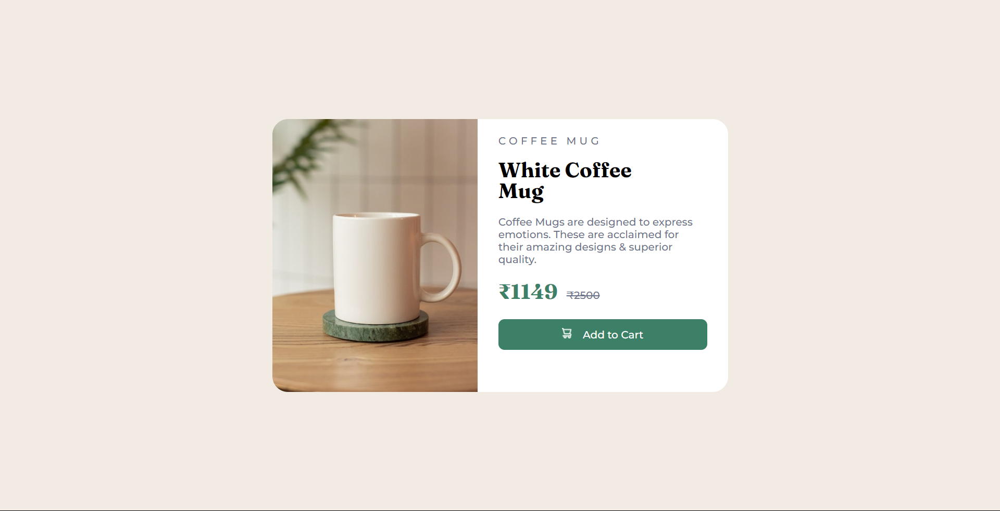

# Coffee House - Sample Product Cart Item

The Coffee House Sample Product Cart Item is a simple web component that showcases a coffee product available for online ordering. This project focuses on improving styling skills and provides an example of how to display coffee product details, including name, ingredients, description, price, and an "Add to Cart" button.



## Table of Contents

- [Overview](#overview)
- [Installation](#installation)
- [Usage](#usage)
- [Technologies Used](#technologies-used)
- [Contributing](#contributing)
- [License](#license)

## Overview

The Sample Product Cart Item provides a visually appealing way to present coffee products for online ordering. Key features include:

- **Product Details:** Display of coffee product name, ingredients, description, and price.

- **Add to Cart:** An "Add to Cart" button allows users to easily add the product to their online shopping cart.

The project serves as a demonstration of front-end styling techniques.

## Installation

1. Clone the repository:

   ```bash
   git clone https://github.com/sargunkohli152/Product-Cart.git

2. Start the application in your code editor

## Usage
To use the Sample Product Cart Item in your web application:

 - Copy the relevant HTML and CSS code from the project to your website's codebase.

 - Customize the product details (name, ingredients, description, price) to match the products available in your coffee house.

 - Ensure that your online ordering system integrates the "Add to Cart" functionality.

## Technologies Used
 - HTML
 - CSS


## Contributing
Contributions are welcome! If you have any suggestions, improvements, or want to enhance the Sample Product Cart Item, please fork the project, make your changes, and submit a pull request.

## MIT License

Permission is hereby granted, free of charge, to any person obtaining a copy of this software and associated documentation files (the "Software"), to deal in the Software without restriction, including without limitation the rights to use, copy, modify, merge, publish, distribute, sublicense, and/or sell copies of the Software, and to permit persons to whom the Software is furnished to do so, subject to the following conditions:

The above copyright notice and this permission notice shall be included in all copies or substantial portions of the Software.

THE SOFTWARE IS PROVIDED "AS IS", WITHOUT WARRANTY OF ANY KIND, EXPRESS OR IMPLIED, INCLUDING BUT NOT LIMITED TO THE WARRANTIES OF MERCHANTABILITY, FITNESS FOR A PARTICULAR PURPOSE AND NONINFRINGEMENT. IN NO EVENT SHALL THE AUTHORS OR COPYRIGHT HOLDERS BE LIABLE FOR ANY CLAIM, DAMAGES OR OTHER LIABILITY, WHETHER IN AN ACTION OF CONTRACT, TORT OR OTHERWISE, ARISING FROM, OUT OF OR IN CONNECTION WITH THE SOFTWARE OR THE USE OR OTHER DEALINGS IN THE SOFTWARE.License 
